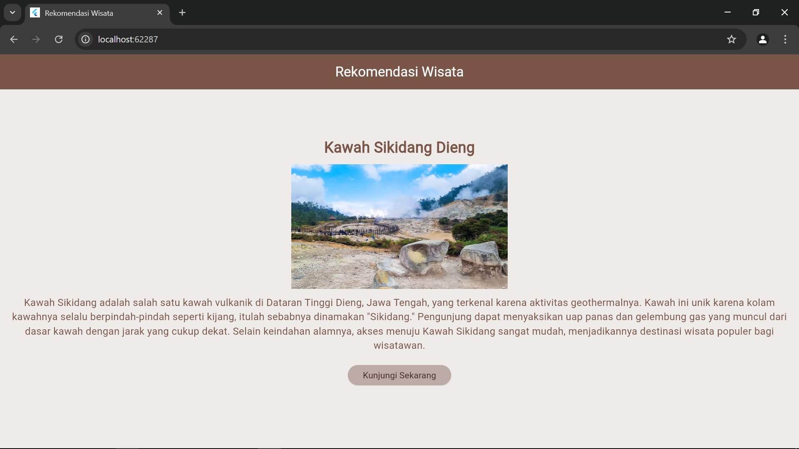

## Modul IV Antarmuka Pengguna

## Tugas Pendahuluan
Buatlah tampilan aplikasi sederhana dalam flutter yang menampilkan deskripsi
rekomendasi tempat wisata dengan mengimplementasikan widget dasar
Detail Tugas:
• AppBar: Buatlah sebuah AppBar dengan judul "Rekomendasi Wisata".
• Text: Di tengah layar, tambahkan widget Text dengan pesan "Nama Tempat
Wisata".
• Image: Tambahkan gambar dari internet di bawah teks tersebut menggunakan
widget Image.network.
• Text: Dibawah gambar, tambahkan deskripsi dari tempat wisata
• Button: Tambahkan tombol di bawah gambar dengan label "Kunjungi Tempat"

## Source Code
import 'package:flutter/material.dart';

void main() {
  runApp(MyApp());
}

class MyApp extends StatelessWidget {
  const MyApp({super.key});

  @override
  Widget build(BuildContext context) {
    return MaterialApp(
      debugShowCheckedModeBanner: false,
      title: 'Rekomendasi Wisata',
      home: WisataPage(),
    );
  }
}

class WisataPage extends StatelessWidget {
  const WisataPage({super.key});

  @override
  Widget build(BuildContext context) {
    return Scaffold(
      appBar: AppBar(
        title: const Text(
          'Rekomendasi Wisata',
          style: TextStyle(color: Colors.white),
        ),
        centerTitle: true,
        backgroundColor: Colors.brown, // Warna AppBar diubah menjadi coklat
      ),
      body: Padding(
        padding: const EdgeInsets.all(16.0),
        child: Center(
          child: Column(
            crossAxisAlignment: CrossAxisAlignment.center,
            children: [
              const SizedBox(height: 60),
              const Text(
                'Kawah Sikidang Dieng', // Judul diubah
                style: TextStyle(
                  fontSize: 24,
                  fontWeight: FontWeight.bold,
                  color: Colors.brown, // Warna teks diubah menjadi coklat tua
                ),
              ),
              const SizedBox(height: 10),
              Image.network(
                'https://encrypted-tbn1.gstatic.com/licensed-image?q=tbn:ANd9GcSHwUMrCKDgr_hb_Eu0Yx3Yk7TRHjuqxL67wPab_o0oylsO1IvhQ4R_H6qc7yvTp-s5W0U3KFiW1spjOlnW593CBwoYXACwP1duBALHv70', // Gambar Kawah Sikidang
                height: 200,
              ),
              const SizedBox(height: 10),
              const Text(
                'Kawah Sikidang adalah salah satu kawah vulkanik di Dataran Tinggi Dieng, Jawa Tengah, yang terkenal karena aktivitas geothermalnya. Kawah ini unik karena kolam kawahnya selalu berpindah-pindah seperti kijang, itulah sebabnya dinamakan "Sikidang." Pengunjung dapat menyaksikan uap panas dan gelembung gas yang muncul dari dasar kawah dengan jarak yang cukup dekat. Selain keindahan alamnya, akses menuju Kawah Sikidang sangat mudah, menjadikannya destinasi wisata populer bagi wisatawan.',
                style: TextStyle(
                  fontSize: 16,
                  color: Colors.brown, // Warna teks diubah menjadi coklat
                ),
                textAlign: TextAlign.center,
              ),
              const SizedBox(height: 20),
              ElevatedButton(
                onPressed: () {
                  // Aksi yang dijalankan saat tombol ditekan
                },
                style: ElevatedButton.styleFrom(
                  backgroundColor: Colors.brown[200], // Warna tombol coklat muda
                  foregroundColor: Colors.brown[900], // Warna teks pada tombol coklat tua
                ),
                child: const Text('Kunjungi Sekarang'),
              ),
            ],
          ),
        ),
      ),
      backgroundColor: Colors.brown[50], // Latar belakang menjadi coklat muda
    );
  }
}

## Output

## Deskripsi Program
Aplikasi ini adalah program Flutter yang memberikan rekomendasi wisata **"Kawah Sikidang"**. Ketika aplikasi dijalankan, di bagian atas layar akan terlihat judul **"Rekomendasi Wisata"** dengan latar belakang ungu pada **AppBar**. Di halaman utama, terdapat informasi tentang **"Kawah Sikidang"**, termasuk gambar wisata yang diambil dari **assets** lokal, serta deskripsi singkat yang menggambarkan keindahan dan keunikan tempat tersebut. Selain itu, terdapat tombol **"Kunjungi Sekarang"** di bagian bawah yang dapat digunakan pengguna untuk berinteraksi lebih lanjut.