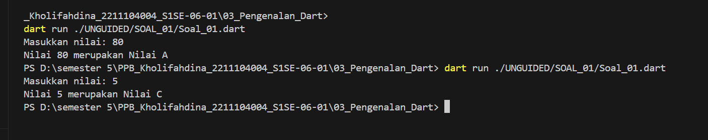

## Tugas Percabangan

Buatlah sebuah fungsi dalam Dart yang menerima sebuah nilai dari user, lalu melakukan
percabangan untuk memberikan output berdasarkan kondisi berikut:

Deskripsi :

a. Jika nilai lebih besar dari 70, program harus mereturn "Nilai A". 

b. Jika nilai lebih besar dari 40 tetapi kurang atau sama dengan 70, program harus
mereturn "Nilai B".

c. Jika nilai lebih besar dari 0 tetapi kurang atau sama dengan 40, program harus
mereturn "Nilai C".

d. Jika nilai tidak memenuhi semua kondisi di atas, program harus mereturn teks
kosong.

Sampel Input: 80

Sampel Output: 80 merupakan Nilai A

Sampel Input: 5

Sampel Output: 50 merupakan Nilai B

## Screenshots Hasil Program

## Penjelasan Program
Kode ini adalah program Dart yang mengevaluasi nilai dan mengembalikan grade berdasarkan input dari pengguna.

1. Fungsi `evaluasiNilai` menerima parameter `nilai` dan mengembalikan grade:
   - Nilai lebih dari 70 mendapatkan grade "A".
   - Nilai antara 40 hingga 70 mendapatkan grade "B".
   - Nilai antara 0 hingga 40 mendapatkan grade "C".
   - Nilai yang tidak valid (misalnya negatif) menghasilkan nilai kosong.

2. Fungsi `main`:
   - Menggunakan `stdout.write` untuk meminta input nilai dari pengguna.
   - Mengonversi input menjadi integer menggunakan `int.tryParse()`.
   - Mengecek validitas input. Jika input valid, memanggil fungsi `evaluasiNilai` untuk menentukan grade dan menampilkan hasilnya. Jika input tidak valid, menampilkan pesan error.

Program ini memberikan grade berdasarkan nilai yang dimasukkan oleh pengguna.