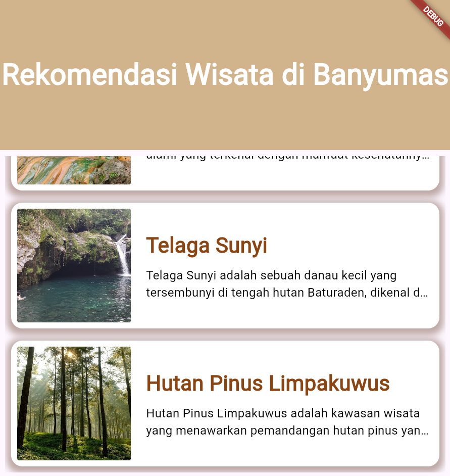

## Deskripsi Program:

Program ini adalah aplikasi berbasis Flutter yang merekomendasikan beberapa tempat wisata di Banyumas, disertai dengan foto, nama wisata, dan deskripsi singkat. Aplikasi ini dirancang dengan antarmuka yang sederhana dan menarik, memanfaatkan ListView.builder untuk menampilkan daftar tempat wisata yang bisa di-scroll secara vertikal. Setiap item dalam daftar terdiri dari gambar wisata, nama, dan deskripsi singkat yang disajikan dalam tata letak yang rapi dan terstruktur.

## Fitur Utama:
1. Header Menarik: Aplikasi ini dimulai dengan bagian header berwarna coklat muda (kode warna: 0xFFD2B48C), yang memberikan suasana hangat. Di tengah header terdapat teks besar dan tebal berwarna putih bertuliskan "Rekomendasi Wisata di Banyumas" untuk menarik perhatian pengguna.
2. ListView untuk Daftar Wisata: Menggunakan ListView.builder, aplikasi menampilkan beberapa tempat wisata di Banyumas dalam bentuk list. Setiap item dalam list mencakup gambar wisata yang diambil dari URL, nama wisata yang ditampilkan dalam huruf besar dan tebal, serta deskripsi singkat yang dibatasi menjadi maksimal dua baris.
3. Desain Responsif: Masing-masing item dalam list memiliki margin dan padding untuk memberikan tampilan yang rapi. Selain itu, ada penggunaan BoxDecoration untuk menambahkan efek bayangan dan sudut melengkung pada setiap card, yang menambah estetika keseluruhan aplikasi.
4. Gambar Wisata: Gambar wisata ditampilkan dengan ukuran 150x150 dan disematkan dalam kontainer dengan sudut melengkung. Jika gambar tidak bisa dimuat, maka akan digantikan dengan ikon gambar yang tidak tersedia (Icons.image_not_supported).
5. Deskripsi Singkat: Setiap deskripsi wisata disajikan secara singkat dengan batas dua baris. Jika deskripsi terlalu panjang, teks akan dipotong secara otomatis dan menampilkan elipsis (...) untuk menjaga tampilan tetap rapi.

## Penjelasan Kode:
1. MainApp Class: MainApp adalah class utama yang menjalankan aplikasi dengan menggunakan MaterialApp sebagai struktur dasar aplikasi Flutter. Komponen visual diletakkan dalam sebuah Scaffold, yang di dalamnya terdiri dari header dan list wisata.
2. Bagian Header: Di bagian atas halaman aplikasi terdapat sebuah Container yang berfungsi sebagai header. Container ini diberi warna latar belakang coklat muda dan memuat teks besar berwarna putih di tengahnya untuk memberikan identitas aplikasi.
3. ListView.builder: Komponen ini digunakan untuk membuat daftar wisata secara dinamis. itemCount berfungsi menentukan berapa jumlah item yang ditampilkan, sedangkan itemBuilder memuat desain tiap item sesuai urutan dari list gambar, judul, dan deskripsi.
4. Desain Setiap Item: Setiap item pada daftar wisata ditempatkan dalam Container dengan margin dan padding yang ditentukan. Gambar wisata dimuat menggunakan Image.network, dan jika gagal, ikon gambar tak tersedia akan ditampilkan.
5. Data Wisata: Terdapat tiga list data yang digunakan: wisataBanyumasImages untuk URL gambar, wisataBanyumasTitles untuk judul wisata, dan wisataBanyumasDescriptions untuk deskripsi singkat wisata. Setiap elemen dalam list ini terhubung berdasarkan indeks.

## Output Screenshot:
Versi Desktop

Versi Mobile
