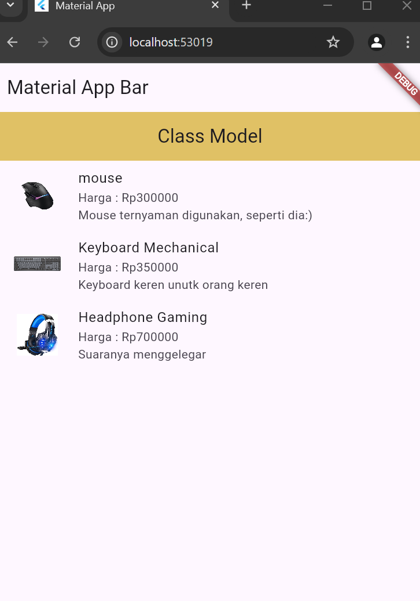
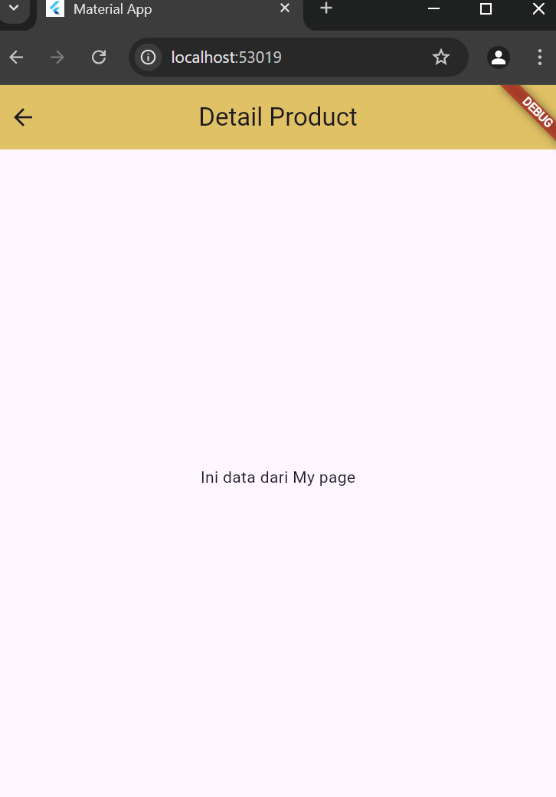

## Penjelasan Program
1. **`Product` Class**:
   - **Model** untuk data produk dengan properti: `id`, `nama`, `harga`, `imageUrl`, dan `deskripsi`.
   - Memiliki:
     - **Constructor** untuk inisialisasi objek `Product`.
     - **`fromJson`**: Fungsi untuk mengonversi data JSON menjadi objek `Product`.
     - **`toJson`**: Fungsi untuk mengonversi objek `Product` menjadi data JSON.

   ```dart
   class Product {
     final int id;
     final String nama;
     final double harga;
     final String imageUrl;
     final String deskripsi;

     Product({
       required this.id,
       required this.nama,
       required this.harga,
       required this.imageUrl,
       required this.deskripsi,
     });

     factory Product.fromJson(Map<String, dynamic> json) {
       return Product(
         id: json['id'],
         nama: json['nama'],
         harga: json['harga'].toDouble(),
         imageUrl: json['imageUrl'],
         deskripsi: json['deskripsi']
       );
     }

     Map<String, dynamic> toJson() {
       return {
         'id': id,
         'nama': nama,
         'harga': harga,
       };
     }
   }
   ```

2. **`DetailProduct` Class**:
   - Halaman detail produk yang menerima `data` dari halaman sebelumnya dan menampilkannya.
   - Menerima data melalui parameter konstruktor dan menampilkannya dalam widget `Text`.

   ```dart
   class DetailProduct extends StatelessWidget {
     const DetailProduct({super.key, required this.data});

     final String data;

     @override
     Widget build(BuildContext context) {
       return Scaffold(
         appBar: AppBar(
           title: Text('Detail Product'),
           centerTitle: true,
           backgroundColor: const Color.fromARGB(255, 224, 193, 101),
         ),
         body: Center(
           child: Text(data),
         ),
       );
     }
   }
   ```

3. **`Mypage` Class**:
   - Halaman utama yang menampilkan daftar produk menggunakan **ListView.builder**.
   - Setiap item daftar menunjukkan gambar produk, nama, harga, dan deskripsi produk.
   - Ketika salah satu item ditekan, akan mengarah ke halaman **DetailProduct** dengan data berupa teks yang ditentukan.

   ```dart
   class Mypage extends StatelessWidget {
     final List<Product> products = [
       Product(
         id: 1,
         nama: 'mouse',
         harga: 300000,
         imageUrl: 'https://resource.logitechg.com/...',
         deskripsi: 'Mouse ternyaman digunakan...',
       ),
       Product(
         id: 2,
         nama: 'Keyboard Mechanical',
         harga: 350000,
         imageUrl: 'https://resource.logitech.com/...',
         deskripsi: 'Keyboard keren untuk orang keren',
       ),
       Product(
         id: 3,
         nama: 'Headphone Gaming',
         harga: 700000,
         imageUrl: 'https://m.media-amazon.com/...',
         deskripsi: 'Suaranya menggelegar',
       ),
     ];

     @override
     Widget build(BuildContext context) {
       return Scaffold(
         appBar: AppBar(
           title: Text('Class Model'),
           centerTitle: true,
           backgroundColor: const Color.fromARGB(255, 224, 193, 101),
         ),
         body: ListView.builder(
           itemCount: products.length,
           itemBuilder: (context, index) {
             final product = products[index];
             return ListTile(
               leading: Image.network(
                 product.imageUrl,
                 width: 70,
                 height: 70,
               ),
               title: Text(product.nama),
               subtitle: Column(
                 crossAxisAlignment: CrossAxisAlignment.start,
                 children: [
                   Text('Harga : Rp${product.harga}'),
                   Text(product.deskripsi),
                 ],
               ),
               onTap: () {
                 Navigator.push(
                   context,
                   MaterialPageRoute(
                     builder: (_) =>
                         DetailProduct(data: 'Ini data dari My page'),
                   ),
                 );
               },
             );
           },
         ),
       );
     }
   }
   ```

4. **`MyApp` Class**:
   - Aplikasi utama yang menjalankan `Mypage` sebagai tampilan awal.
   - Menggunakan `MaterialApp` untuk pengaturan tema dan struktur aplikasi.

   ```dart
   class MyApp extends StatelessWidget {
     const MyApp({super.key});

     @override
     Widget build(BuildContext context) {
       return MaterialApp(
         title: 'Material App',
         home: Scaffold(
           appBar: AppBar(
             title: const Text('Material App Bar'),
           ),
           body: Mypage(),
         ),
       );
     }
   }
   ```

### Fungsi Utama:
- **`Product` class**: Digunakan untuk menyimpan data produk dengan berbagai atribut dan mengkonversinya ke format JSON atau sebaliknya.
- **`Mypage` class**: Menampilkan daftar produk dalam `ListView`, memungkinkan pengguna menavigasi ke halaman detail produk.
- **`DetailProduct` class**: Menampilkan detail produk berdasarkan data yang diterima dari halaman sebelumnya.

### Output:
- **Halaman utama** menampilkan daftar produk dengan gambar, harga, dan deskripsi.
- **Detail halaman** menunjukkan data produk yang dipilih dari daftar.


# SS Output


