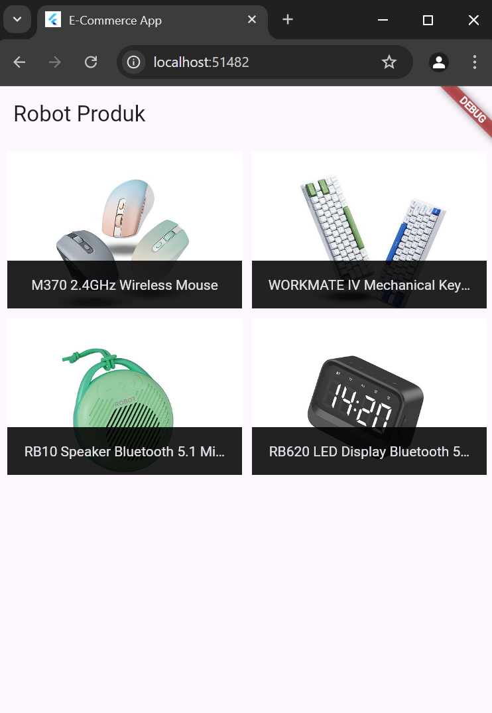
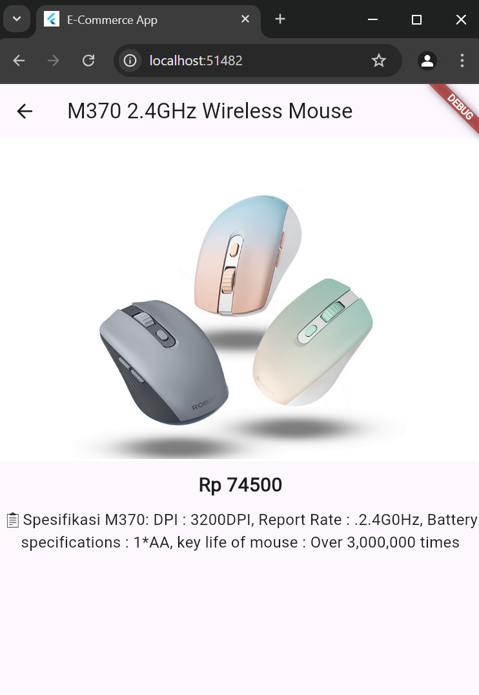
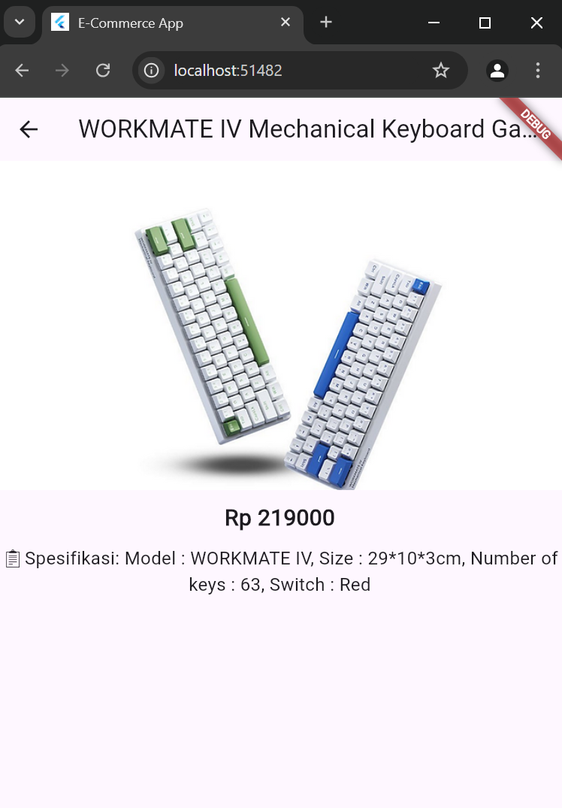
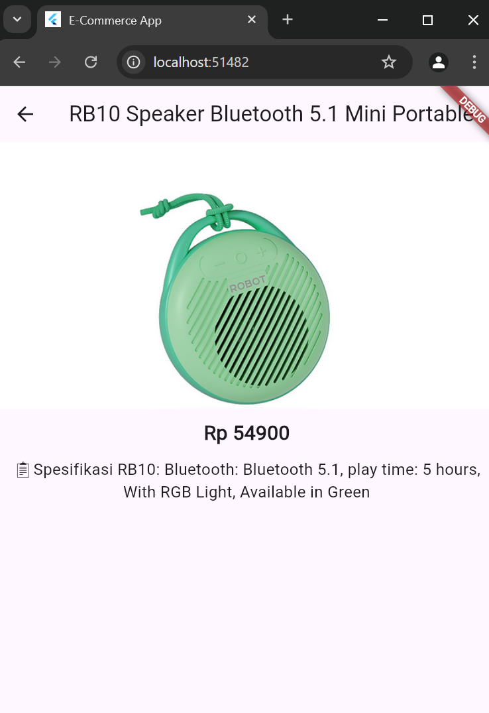
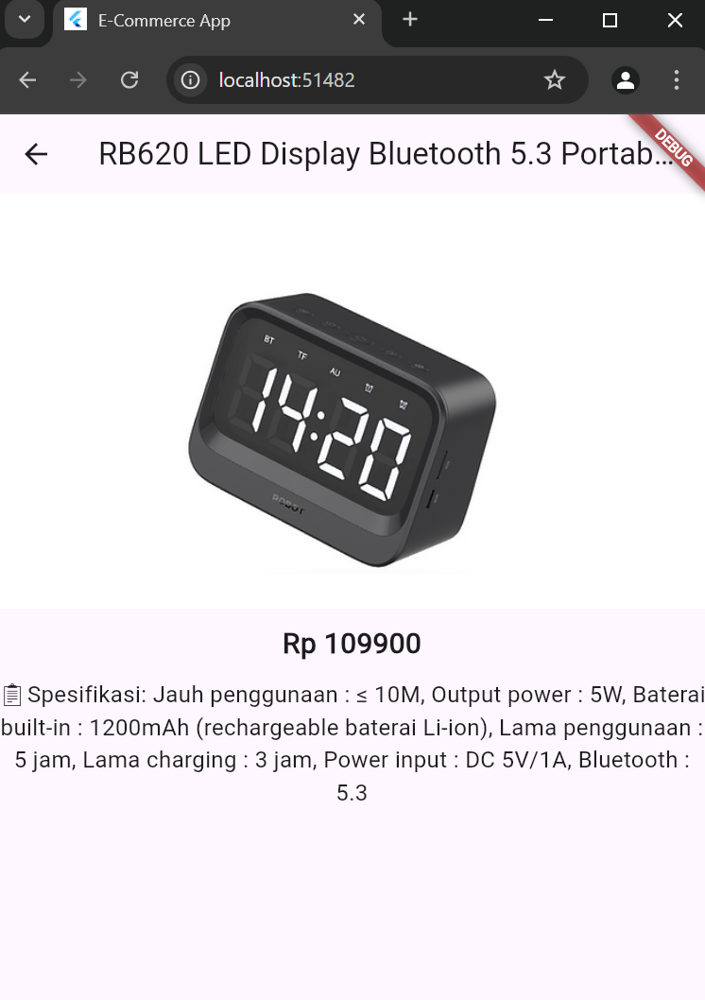

## Penjelasan Program

### 1. **`Product` Class** (Model):
   - **Tujuan**: Menyimpan data produk dengan atribut `id`, `title`, `description`, `price`, dan `imageUrl`.
   - **Constructor**: Digunakan untuk menginisialisasi objek `Product` dengan parameter yang dibutuhkan.

   ```dart
   class Product {
     final String id;
     final String title;
     final String description;
     final double price;
     final String imageUrl;

     Product({
       required this.id,
       required this.title,
       required this.description,
       required this.price,
       required this.imageUrl,
     });
   }
   ```

### 2. **`dummy_data.dart`**:
   - **Tujuan**: Menyediakan data produk dummy dalam bentuk list `DUMMY_PRODUCTS`.
   - **Data Produk**: Menyimpan beberapa produk yang digunakan dalam aplikasi, dengan informasi seperti `id`, `title`, `description`, `price`, dan `imageUrl`.

   ```dart
   final List<Product> DUMMY_PRODUCTS = [
     Product(
       id: 'p1',
       title: 'M370 2.4GHz Wireless Mouse',
       description: '📋Spesifikasi M370...',
       price: 74500,
       imageUrl: 'https://...',
     ),
     // Produk lainnya...
   ];
   ```

### 3. **`home_screen.dart`**:
   - **Tujuan**: Menampilkan daftar produk dalam tampilan grid menggunakan `GridView.builder`.
   - **Penggunaan**: Menggunakan `ProductItem` untuk menampilkan setiap produk di grid.

   ```dart
   class HomeScreen extends StatelessWidget {
     @override
     Widget build(BuildContext context) {
       return Scaffold(
         appBar: AppBar(
           title: Text('Robot Produk'),
         ),
         body: GridView.builder(
           padding: const EdgeInsets.all(10),
           gridDelegate: SliverGridDelegateWithFixedCrossAxisCount(
             crossAxisCount: 2,
             childAspectRatio: 3 / 2,
             crossAxisSpacing: 10,
             mainAxisSpacing: 10,
           ),
           itemCount: DUMMY_PRODUCTS.length,
           itemBuilder: (ctx, i) => ProductItem(
             id: DUMMY_PRODUCTS[i].id,
             title: DUMMY_PRODUCTS[i].title,
             imageUrl: DUMMY_PRODUCTS[i].imageUrl,
           ),
         ),
       );
     }
   }
   ```

### 4. **`product_detail_screen.dart`**:
   - **Tujuan**: Menampilkan detail produk saat item di grid ditekan.
   - **Fitur**: Menampilkan gambar produk, harga, dan deskripsi lengkap produk.

   ```dart
   class ProductDetailScreen extends StatelessWidget {
     final String id;

     ProductDetailScreen({required this.id});

     @override
     Widget build(BuildContext context) {
       final product = DUMMY_PRODUCTS.firstWhere((prod) => prod.id == id);
       return Scaffold(
         appBar: AppBar(
           title: Text(product.title),
         ),
         body: Column(
           children: [
             Image.network(product.imageUrl),
             Text('Rp ${product.price.toStringAsFixed(0)}'),
             Text(product.description),
           ],
         ),
       );
     }
   }
   ```

### 5. **`product_item.dart`**:
   - **Tujuan**: Menampilkan item produk dalam grid sebagai tile.
   - **Fitur**: Ketika pengguna menekan tile, mereka diarahkan ke halaman detail produk menggunakan `Navigator`.

   ```dart
   class ProductItem extends StatelessWidget {
     final String id;
     final String title;
     final String imageUrl;

     ProductItem({required this.id, required this.title, required this.imageUrl});

     @override
     Widget build(BuildContext context) {
       return GestureDetector(
         onTap: () {
           Navigator.of(context).push(
             MaterialPageRoute(
               builder: (ctx) => ProductDetailScreen(id: id),
             ),
           );
         },
         child: GridTile(
           child: Image.network(imageUrl, fit: BoxFit.cover),
           footer: GridTileBar(
             backgroundColor: Colors.black87,
             title: Text(title, textAlign: TextAlign.center),
           ),
         ),
       );
     }
   }
   ```

### 6. **`main.dart`**:
   - **Tujuan**: Menjalankan aplikasi dengan halaman utama (`HomeScreen`).
   - **Pengaturan Aplikasi**: Menggunakan `MaterialApp` untuk mengatur tema dan struktur aplikasi.

   ```dart
   void main() {
     runApp(MyApp());
   }

   class MyApp extends StatelessWidget {
     @override
     Widget build(BuildContext context) {
       return MaterialApp(
         title: 'E-Commerce App',
         theme: ThemeData(
           primarySwatch: Colors.blue,
         ),
         home: HomeScreen(),
       );
     }
   }
   ```

### Alur Aplikasi:
1. **Halaman Utama (`HomeScreen`)**:
   - Menampilkan produk dalam bentuk grid menggunakan `GridView.builder`.
2. **Detail Produk (`ProductDetailScreen`)**:
   - Menampilkan informasi detail produk yang dipilih, seperti gambar, harga, dan deskripsi.
3. **Navigasi**:
   - Ketika produk ditekan di halaman utama, aplikasi menavigasi ke halaman detail menggunakan `Navigator`.


# SS Output




